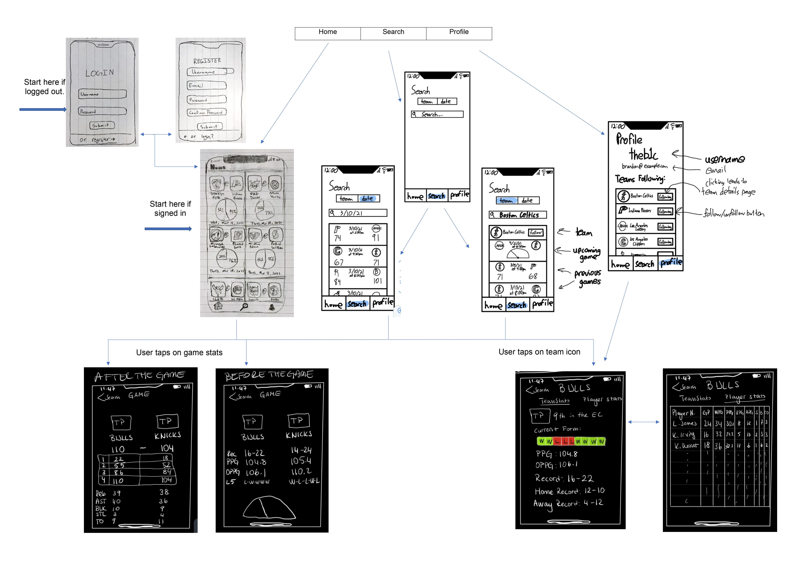

# Dubb Club iOS

## Table of Contents
1. [Overview](#Overview)
1. [Product Spec](#Product-Spec)
1. [Wireframes](#Wireframes)

## Overview
### Description
Dubb Club makes predictions for upcoming NBA games and displays the confidence of those predictions, along with other game and team statistics. It can be used to help with sports betting, or just by those who are fans of sports in general.

### App Evaluation
- **Category:** Sports
- **Mobile:** This app can be developed for computer or mobile. However, the mobile version requires differences in design to accommodate the smaller screen size and smartphone UX.
- **Story:**  Predicts outcomes of NBA games and presents results to users along with other game and team statistics.
- **Market:** Any individual could choose to use this app, but the main focus is those who have an interest in the NBA or sports in general. 
- **Habit:** Usage of this app depends on just how interested a user is in the NBA or if they enjoy betting on sports games. It is also expected usage would decrease during the offseason.
- **Scope:** We are first starting with just NBA games, but there is room for growth in adding other major sporting leagues and potentially adding other social media features like forums or voting on probabilities.

## Product Spec
### 1. User Stories (Required and Optional)

**Required Must-have Stories**
-   Make an account.
-   Login
-   Follow/unfollow teams.
-   Search games (by name)
-   View games schedule.
-   View upcoming game predictions
-   View played game stats.
-   View profile page

**Optional Nice-to-have Stories**
-   View team and player stats
-   Vote on game outcomes
-   Sorting by confidence, etc.
-   Store/cache data locally
-   Change password.

### 2. Screen Archetypes
-   Login Screen
	-   User can login
-   Registration Screen
	-   User can create a new account
-   Stream
	-   User can view a feed of game predictions and stats
	-   User can vote on what they think the outcome of a game will be (optional)
-   Team Details
	-   User can view a team’s record and average statistics
	-   User can view player statistics for a given team
-   Past Game Details
	-   User can view statistics about a specific game
	-   User can view a team’s record
-   Search 
	-   User can search for a specific team and view predictions and previous results
	-   User can select a game to view the game details
-   Profile
	-   User can view their identity
	-   User can view their followed teams
-   Settings (optional)
    -   User can view account details
	-   User can change their password

### 3. Navigation

**Tab Navigation** (Tab to Screen)

-   Home Stream
-   Search Page
-	Profile

**Flow Navigation** (Screen to Screen)
-   Login Screen -> Registration Screen/Home Stream
-   Registration Screen -> Login Screen/Home Stream
-   Stream -> Team Details/Game Details
-   Search -> Team Details/Game Details
-   Profile -> Settings/Team Details
-	Settings -> Toggle settings

## Wireframes

